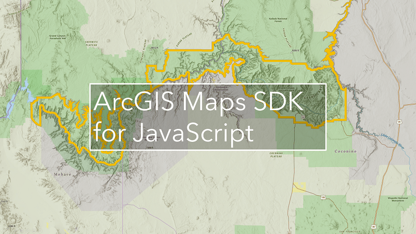

# arcgis-samples-4.0-js

ArcGIS Maps SDK for JavaScript のサンプル集です。  
ArcGIS Maps SDK for JavaScript は Web ブラウザー向けのアプリケーションや Web サイトに GIS（地図）機能を組み込むための API を提供します。

## 使用している製品・プロジェクト

* [ArcGIS Masp SDK for JavaScript](https://developers.arcgis.com/javascript/)
* [ArcGIS Developers](https://developers.arcgis.com/en/)

**[ArcGIS Developers](https://developers.arcgis.com/en/) の[開発者アカウント](http://esrijapan.github.io/arcgis-dev-resources/get-dev-account/)を作成すれば無償で開発での利用が可能です
。**

## 動作環境

[製品ページ](https://www.esrij.com/products/arcgis-maps-sdk-for-javascript/spec/)をご参照ください。

## リソース

* [ArcGIS Developers 開発リソース集](http://esrijapan.github.io/arcgis-dev-resources/)
* [開発ブログ（GeoNet）](https://geonet.esri.com/groups/devcom-jp)
* [ArcGIS Maps SDK for JavaScript（ESRIジャパン）](http://www.esrij.com/products/arcgis-api-for-javascript/)
* [API リファレンス](https://developers.arcgis.com/javascript/latest/api-reference/)

## ライセンス
Copyright 2016 Esri Japan Corporation.

Apache License Version 2.0（「本ライセンス」）に基づいてライセンスされます。あなたがこのファイルを使用するためには、本ライセンスに従わなければなりません。本ライセンスのコピーは下記の場所から入手できます。

> http://www.apache.org/licenses/LICENSE-2.0

適用される法律または書面での同意によって命じられない限り、本ライセンスに基づいて頒布されるソフトウェアは、明示黙示を問わず、いかなる保証も条件もなしに「現状のまま」頒布されます。本ライセンスでの権利と制限を規定した文言については、本ライセンスを参照してください。

ライセンスのコピーは本リポジトリの[ライセンス ファイル](./LICENSE)で利用可能です。

