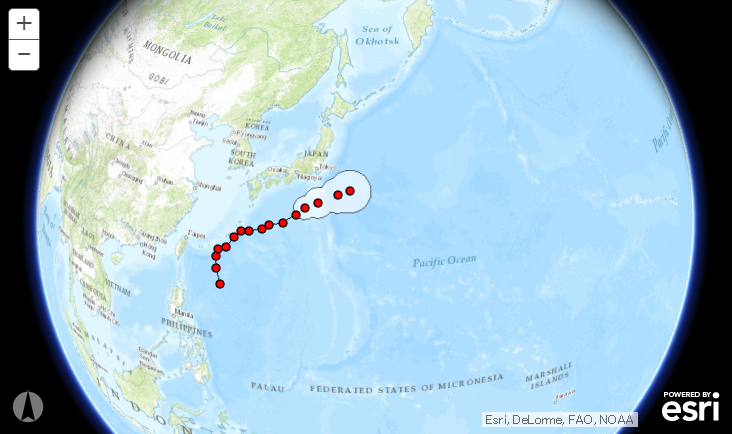

# Feature Layer

## サンプル
[台風情報](https://esrijapan.github.io/arcgis-samples-4.0-js/beta/beta1/featureLayer/index.html)

## リソース

* [ArcGIS API 4.0 for JavaScript](https://developers.arcgis.com/javascript/beta/)
    + [esri/layers/FeatureLayer](https://developers.arcgis.com/javascript/beta/api-reference/esri-layers-FeatureLayer.html)