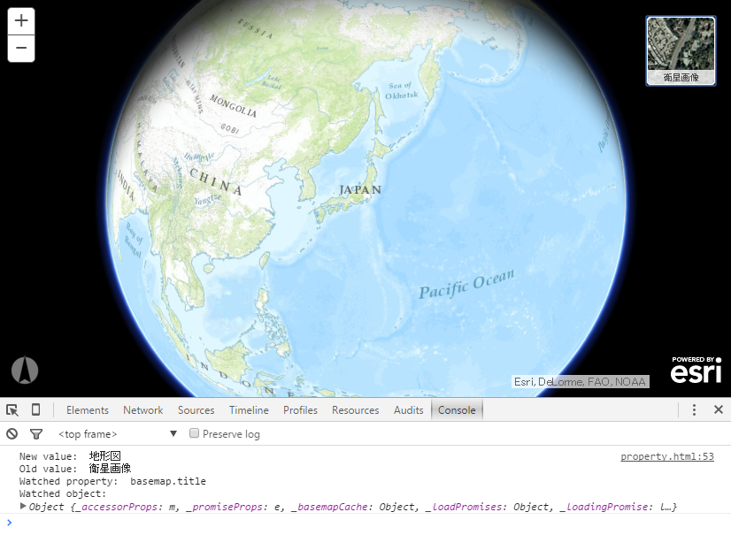

# プロパティ アクセス

## サンプル
[プロパティ アクセス](https://esrijapan.github.io/arcgis-samples-4.0-js/beta/beta1/properties/index.html)

## リソース

* [ArcGIS API 4.0 for JavaScript](https://developers.arcgis.com/javascript/beta/)