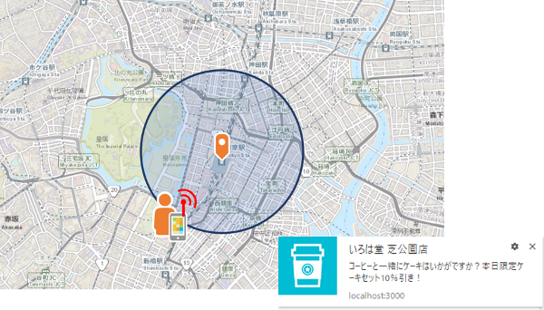

# 位置情報をトリガーにプッシュ通知を送ってみる



## 概要

[Service Worker](https://developer.mozilla.org/ja/docs/Web/API/ServiceWorker_API) と [Push API](https://developer.mozilla.org/ja/docs/Web/API/Push_API) を使用して、[ジオフェンス](https://www.esrij.com/gis-guide/gis-other/geo-fense/)に入った端末へプッシュ通知を送るサンプルです。

詳細は [位置情報をトリガーにプッシュ通知を送ってみる](https://community.esri.com/docs/DOC-11017)をご参照ください。

## 使い方

1. サンプルをクローンまたはダウンロードします。
2. モジュールをインストールします。

```bash
npm install
```

3. サーバーを起動します。

```bash
npm start
```

4. Web ブラウザーを立ち上げ以下の URL へアクセスします。

    http://localhost:3000
