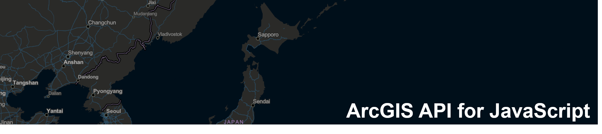

# はじめての Web マッピングアプリケーション開発

## 概要

はじめて地図アプリ開発を行う開発者の方に向けて、ArcGIS API for JavaScript  を使用した Web アプリ開発の流れを紹介するサンプルです。  
詳細は<a href="https://community.esri.com/docs/DOC-11394" target="_blank">はじめての Web マッピングアプリケーション開発</a>をご参照ください。
